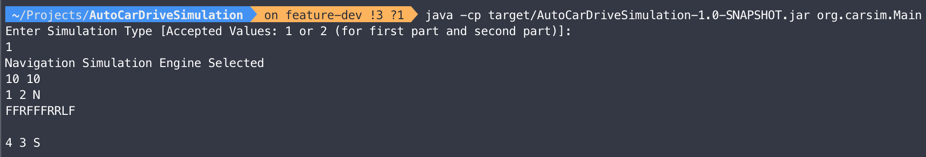
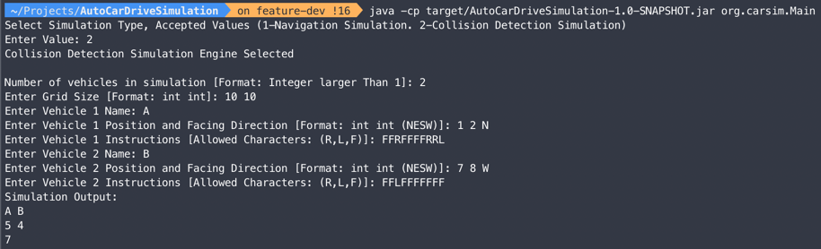
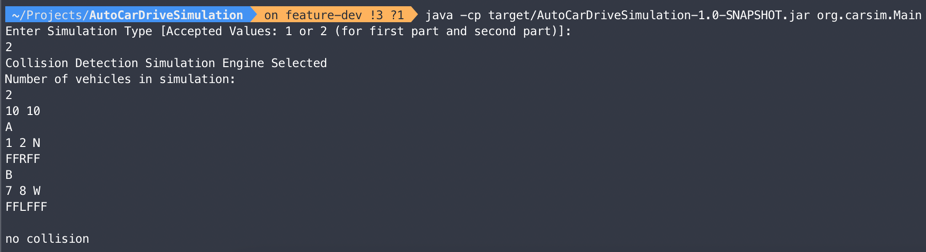

# Auto Driving Car Simulation

This Java project simulates the movement of auto-driving cars on a rectangular field. The cars can move forward, rotate left, or rotate right based on given commands. The project consists of two simulation engines. Part 1 of the project is a navigation simulation engine. Part 2 is a collision detection simulation engine.

It supports three main simulation commands
- L: rotates the car by 90 degrees to the left
- R: rotates the car by 90 degress to the right
- F: moves forward by 1 grid point


### Simulation Engine Selection

In the application user will be prompted to select a simulation engine. 

```
Enter Simulation Type [Accepted Values: 1 or 2 (for first part and second part)]:
1 (or 2)
```

If the user selects the collision simulation, they will be prompted to select the number of vehicles in the simulation.

```
Number of vehicles in simulation:
1
```
Subsequent user inputs should adhere to the order and format specified in the following sections.

## Part 1 - Navigation Simulation

In this part, the simulation is performed for a single car on the field. The program takes input indicating the size of the simulation grid, the initial position and orientation (facing diretion) of the car, and a sequence of commands. The output 
shows the final position and orientation of the car after simulating the commands.


Sample input

```
10 10
1 2 N
FFRFFFRRLF
```

Sample output
```
4 3 S
```

## Part 2 - Collision Detection

In this part, multiple cars are deployed on the field simultaneously. The program takes input indicating the size of the field and sections for each car, including their initial positions, facing directions, and sequences of commands to execute. The output determines whether the cars collide with each other at any point during their movements.

Sample input

```
10 10
A
1 2 N
FFRFFFFRRL
B
7 8 W
FFLFFFFFFF
```

Sample output
```
A B
5 4
7
```


### Tech Stack

**Java 8**, **Maven 3.6** , **Junit5**

### Compile

To compile this project execute in root directory

```bash
  mvn compile
```

### Run Tests
To run tests in this project execute in root directory

```bash
  mvn test
```

### Run as Jar

```bash
mvn package

java -cp target/AutoCarDriveSimulation-1.0-SNAPSHOT.jar org.carsim.Main
```

### Run as part of Build

To run this project run execute in root directory

```bash
  mvn exec:java -Dexec.mainClass="org.carsim.Main"
```

### Testing Screenshots

- Navigation Simulation




- Collision Detection Simulation






