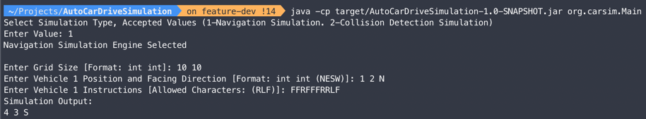

# Auto Driving Car Simulation

This Java project simulates the movement of auto-driving cars on a rectangular field. The cars can move forward, rotate left, or rotate right based on given commands. The project consists of two simulation engines. Part 1 of the project is a navigation simulation engine. Part 2 is a collision detection simulation engine.

It supports three main simulation commands
- L: rotates the car by 90 degrees to the left
- R: rotates the car by 90 degrees to the right
- F: moves forward by 1 grid point


### Simulation Engine Selection

In the application user will be prompted to select a simulation engine. 

```
Select Simulation Type, Accepted Values (1-Navigation Simulation. 2-Collision Detection Simulation)
Enter Value: 
```

If the selection is successful application will provide a confirmation message as follows (According to the selected simulation engine)

```
Navigation Simulation Engine Selected
```

```
Collision Detection Simulation Engine Selected
```

Subsequent user inputs should adhere to the order and format specified in the following sections.

## Part 1 - Navigation Simulation Engine

In this part, the simulation is performed for a single car on the field. The program takes input indicating the size of the simulation grid, the initial position and orientation (facing diretion) of the car, and a sequence of commands. The output 
shows the final position and orientation of the car after simulating the commands.

#### Sample Input

User will be prompted to provide inputs to the application with instructions.

```
Enter Grid Size [Format: int int]: 10 10
Enter Vehicle 1 Position and Facing Direction [Format: int int (NESW)]: 1 2 N
Enter Vehicle 1 Instructions [Allowed Characters: (RLF)]: FFRFFFRRLF
```

#### Sample output

Simulation engine will output following message, which is the final position of the vehicle.
The message contains the final position and the orientation (facing direction) of the car.

```
Simulation Output:
4 3 S
```

## Part 2 - Collision Detection Simulation Engine

In this part, multiple cars are deployed on the field simultaneously. The program takes input indicating the size of the field and sections for each car, including their initial positions, facing directions, and sequences of commands to execute. The output determines whether the cars collide with each other at any point during their movements.

If the user selects the collision simulation, application will prompt to select the number of vehicles in the simulation.

```
Number of vehicles in simulation [Format: Integer Larger Than 1]: 2
```

#### Sample input

After selecting number of vehicles user will be prompted to input data such as simulation grid size and other simulation data for each vehicle. 
```
Enter Grid Size [Format: int int]: 10 10
Enter Vehicle 1 Name: A
Enter Vehicle 1 Position and Facing Direction [Format: int int (NESW)]: 1 2 N
Enter Vehicle 1 Instructions [Allowed Characters: ((R,L,F))]: FFRFFFFRRL
Enter Vehicle 2 Name: B
Enter Vehicle 2 Position and Facing Direction [Format: int int (NESW)]: 7 8 W
Enter Vehicle 2 Instructions [Allowed Characters: ((R,L,F))]: FFLFFFFFFF
```

#### Sample output 

The engine will detect whether there will be a collision or not by simulating each vehicle.

Following is the output message format from the simulation engine when collision is detected.
First line of the message contains space separated vehicle names that are collided. Second line is position information and
the final line contains the step number in which the collision occurred.

(For values in the sample input a collision is expected to occur in the simulation. )
```
Simulation Output:
A B
5 4
7
```

If there is no collision in the simulation, the engine will provide following output.

```
Simulation Output:
no collision
```


### Tech Stack

**Java 8**, **Maven 3.6** , **Junit5**

### Compile

To compile this project execute in root directory

```bash
  mvn compile
```

### Run Tests
To run tests in this project execute in root directory

```bash
  mvn test
```

### Run as Jar

To run this project as JAR executable run following commands in project's root directory.

```bash
mvn package

java -cp target/AutoCarDriveSimulation-1.0-SNAPSHOT.jar org.carsim.Main
```

## Testing Screenshots

Following screenshots are obtained by executing the sample test cases given in the requirement document.

- Navigation Simulation




- Collision Detection Simulation

Below screenshot is captured when there is collision in the simulation at the 7th Step


Below screenshot is captured when there is no collision detected.


